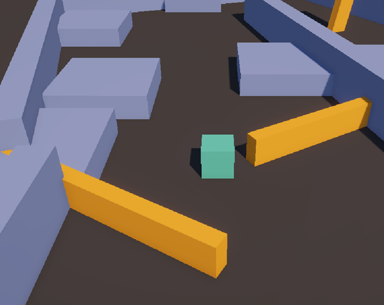

# Unity 3D Developer Course Games

This repository contains games built with C# and Unity Engine by following [Gamedev.tv's Complete Unity 3D Developer: Design & Develop Games in Unity 6 using C# course.](https://www.gamedev.tv/courses/unity6-complete-3d)

_Made and Tested with **Unity 6000.1.8f1**_

## Games (Itch.io Playable Links)

- [Obstacle Dodge](https://calippooo.itch.io/obstacle-dodge)

## Screenshots

*Obstacle Dodge Game*

---
